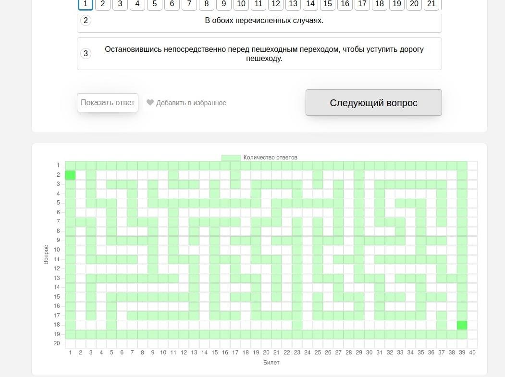
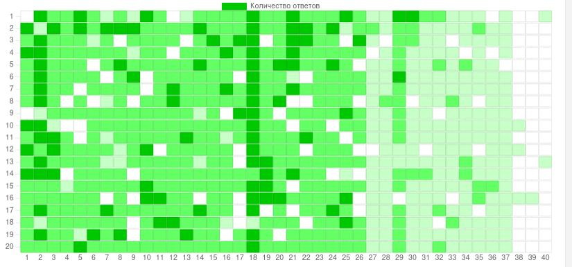

# Readme

## Структура документа

- [Readme](#readme)
  - [Структура документа](#структура-документа)
  - [Структура проекта](#структура-проекта)
    - [Commandor](#commandor)
    - [Executor](#executor)
  - [Демонстрация](#демонстрация)
  - [Что сделано](#что-сделано)
  - [Что надо сделать](#что-надо-сделать)

## О чём проект?

Суть - формирование "pixel-art", рисунка, "пиксель арт" (далее пиксельарт) на сайте pdd-exam.ru для решения экзаменационных билетов по ПДД 2025 года по григорианскому календарю (в частности РФ).
Подход подразумевает управление некоторым исполнителем команд (executor), который управляется с помощью некоторого сервера (commandor).

### О полотне

Всего на данный момент доступно 40 билетов по 20 вопросов, однако, сам ресурс предоставляет возможность ответить на вопрос 3 раза. То есть имеем:

- высота полотна 20 единиц
- ширина полотна 40 единиц
- цветовая палитра каждого пиксела - 4 значения (что-то в роде : белый, светло-зелёный, (кричащий) зелёный, тёмно-зелёный)

## Структура проекта

Имеются два отдельных модуля:

1) Commandor для управления executor
2) Executor различные реализации для выполнения команд, поступающих от commandor

### Commandor

Документация [здесь](src/commandor/readme.md)

### Executor

Документация [здесь](src/executor/readme.md)

## Демонстрация

Например, пиксельарт некоторого лабиринта:

В то время как среднестатистический пиксельарт для каждого билета выглядит следующим образом:

## Что сделано

API для управления executor

### Как запустить?

устанавливаем зависимости
запускаем сервер (make rum)
запускаем executor
Пока через api тыкаем:
- run driver (id = 0)
- init webdriver (id = 0)
- fill current knowledge (id=0, value = 0)
- fill current knowledge (id=0, value = 0)
- fill by labyrinth (id=0)

## В чём проблема

Вероятно, никто из других пользователей не может увидеть так называемый пиксельарт, только сам создатель. 

## Что надо сделать

- [ ] Добавить логирование
- [ ] более контролируемый executor
  - [ ] чтобы можно было переподключиться
- [ ] документация
- [ ] корректное, самостоятельное сохранение статуса executor для продолжения выполнения
- [ ] добавить упора на некоторого рода "инфраструктуру" пиксельартов
  - [ ] разнообразить генерации
  - [ ] обмен ими
  - [ ] визуальное редактирование
  - [ ] и т.д.
- [ ] исправить requirements.txt, добавив только необходимые зависимости
  - [ ] расписать за каждую зависимость по необходимости
- [ ] сделать GUI для API
